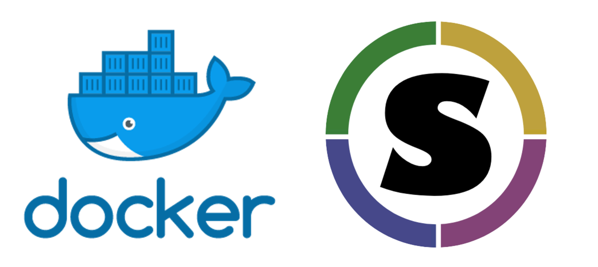

# Installing and managing bioinformatics software  

## Introduction

Bioinformatics software can be installed and managed in a number of ways. It is important to be keep track of software versions so that you can report what was used for specific analyses/projects.

In this lesson, we will introduce the major ways bioinformatics packages can be installed and managed through a command line interface.

---

## Installing Bioinformatics Software Using a CLI

Bioinformatics software can be obtained in several ways.  Depending on the software to be installed, it may be available in one of the following formats:  
 - Pre-installed on your system (eg. modules on Discovery)
 - Language-specific package managers (eg. R/Bioconductor, Python/pip)
 - Full package and environment management tools (eg. Conda)
 - Pre-compiled binary executable
 - Source code to be compiled
 - Virtual machine images (eg. Docker, Singularity)

## Software pre-installed on the system
Linux systems will have many core utilities for navigating the file system, creating, editing and removing files, downloading and uploading files, compiling code, submitting jobs to a cluster, and many more.  These utilities are commonly found in `/usr/bin`.  

On Discovery, software is also made available to users via system-wide modules. See modules section in this lesson.

## Language-specific package managers
Package managers for specific programming languages aim to make the installation of packages or libraries more simple, and from a central location. This allows software to be installed using a single command, rather than having to search the internet for each piece of software and download/install it separately.

For R, packages are available from two major sources:  
- [*CRAN*](https://cran.r-project.org/web/packages/available_packages_by_name.html) - A large diverse collection of R packages currently approaching 17,000 in total
- [*Bioconductor*](https://www.bioconductor.org/) - a specific collection of packages specifically geared toward facilitating bioinformatic data analysis in R

To install R packages from CRAN (within R):
```R
# Install ggplot2 from CRAN
install.packages('ggplot2')
```

To install R packages from Bioconductor (within R):
```R
# Get Bioconductor, if not installed already
install.packages("BiocManager")
# Install DESeq2 from Bioconductor
BiocManager::install("DESeq2")
```

In Python, packages are available in PyPI. To install Python packages from PyPI (from within thebash shell):
```shell
# Install matplotlib from PyPI
pip install matplotlib
```

## Full package and environment management tools (eg. Conda)


```bash
conda create -n python=3.7.1
```


```bash
conda activate x
```


```bash
conda deactivate
```

# channels


## Pre-compiled binary executable
Some developers will pre-compile releases of their software for several operating systems and make them available for download. If a pre-compiled executable is available for the Linux system we are using (for Discovery, this is CentOS 7), this can be a painless way to install software. It only requires downloading the executable to a directory and running it.

Programs written in Java are frequently distributed as JAR files, which are similar to pre-compiled binaries, in that only a single file is required to download and install the software.  The JAR file is then run using the `java -jar` command.
```shell
java -jar some_software.jar
```

## Source code to be compiled
If software is not available via a package manager, or via a pre-compiled executable, it must be compiled from source code.  For Bioinformatics software, this will usually be C or C++ code, and will be distributed with a "makefile", which can be compiled with the following commands.  

The `--prefix="/path/to/install"` defines the directory where the software will be installed.
```shell
./configure --prefix="/path/to/install"
make
make install
```

With package managers becoming more widespread, you should only rarely need to install software by compiling source code.

## Virtual machine images (eg. Docker, Singularity)
Virtual machine images allow software to be distributed along with an entire linux environment.  This ensures that anyone running the software will be able to, regardless of software installed or environment variables.  However, Docker is not currently available on Discovery, as it requires administrator permissions to run.  Some images may be run with Singularity.


