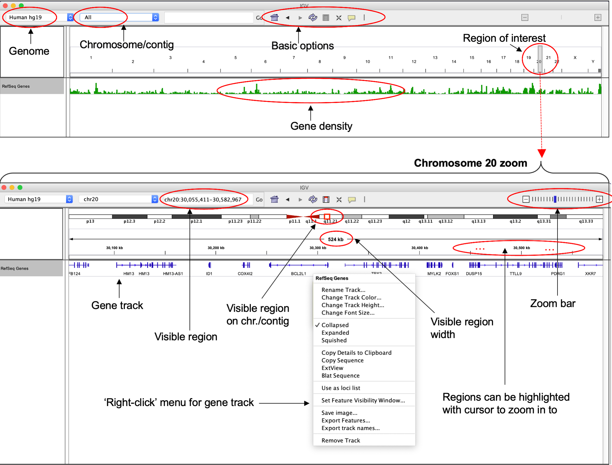
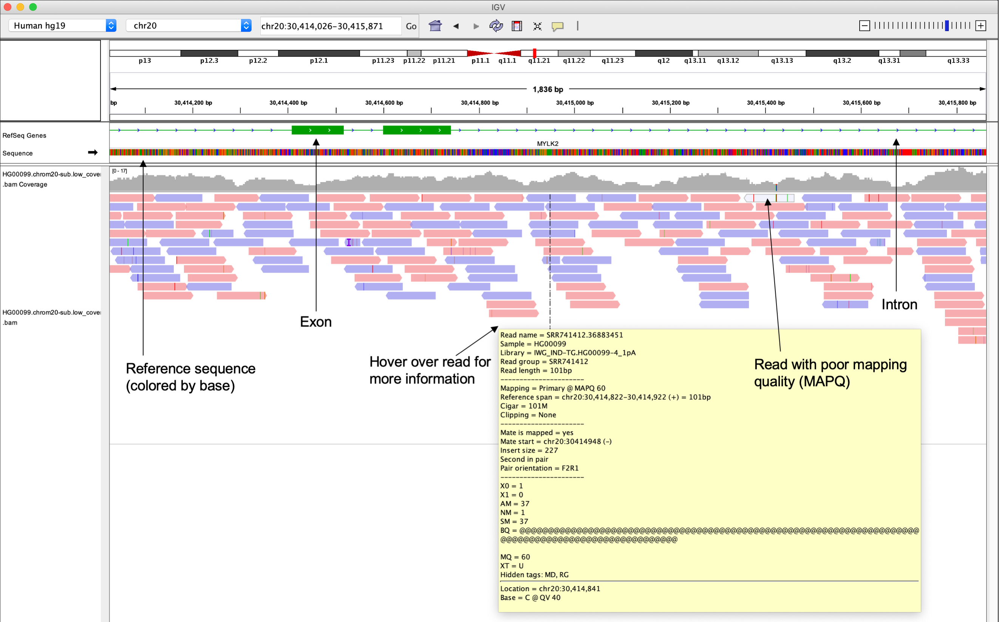
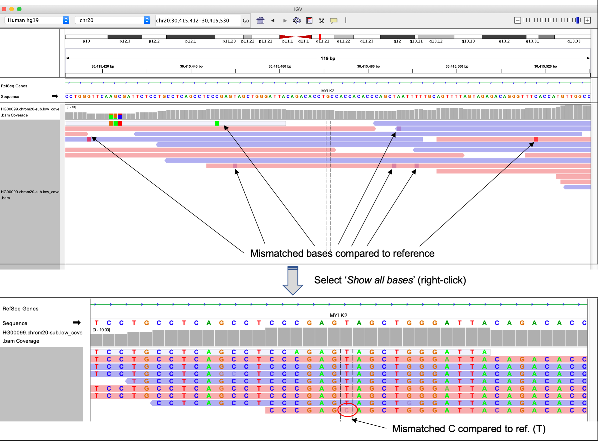
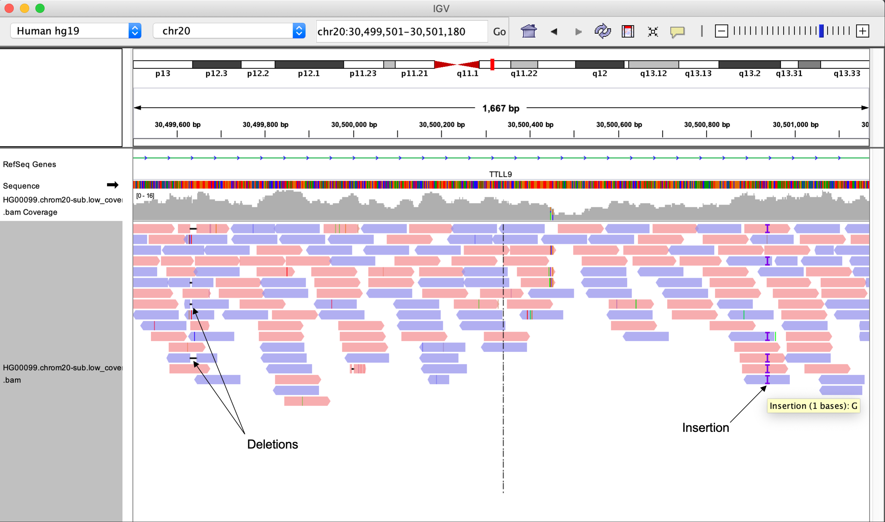
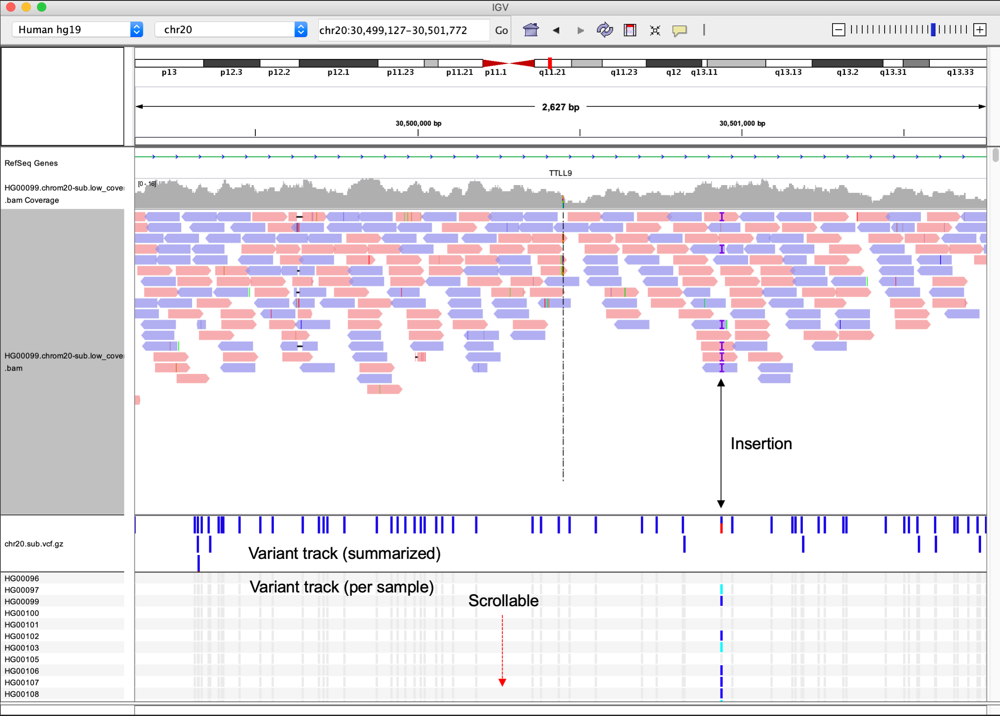

# Introduction to the Integrative Genomics Viewer (IGV)

## What is IGV?

The **Integrative Genomics Viewer (IGV)** is a very powerful piece of genomics software produced and distributed by researchers from the Broad Institute at MIT. IGV provides a fast and easy way to explore and visualize genomics data stored in various formats.


## Learning objectives:  
* Introduce IGV, its basic user interface, and basic data navigation
* Loading genomes and data into an IGV session
* Discuss and explore how IGV represents data stored across distinct file types
* Discuss exploratory analyses and visualizations that IGV is useful for
* Reading in custom genomes
* Saving and restoring an IGV session

<hr>

IGV supports a wide-range of genomic file formats that contain data ranging from simple genomic regions, to complex alignments and signal tracks. File types suppoprted by IGV include:  
* .BAM - alignments  
* .GTF/GFF - genomic features  
* .VCF - variant call format  
* .BED - genmoic regions   
* .BIGWIG - signal tracks

The range of file formats supported by IGV means it is able to facilitate exploration and visualization of virtually all types of genomics data generated from diverse experimental procedures, for example:
* Gene expression data (RNA-seq)  
* SNP, mutation and copy number data (WES, WGS)  
* Transcription factor binding sites (ChIP-seq)  
* Histone modifications (ChIP-seq)  
* Chromatin accessibility (ATAC-seq)  
* Methylation (Bisulfite sequencing)  

The IGV server also hosts a number of reference genomes and annotations, meaning you do not need to load your own genome from a file for many model organisms. You can view the list of hosted genomes on their website [here](http://software.broadinstitute.org/software/igv/Genomes). IGV also provide access to data from large consortia-scale projects such as [*ENCODE*](https://www.encodeproject.org/), [*1000 Genomes*](https://www.internationalgenome.org/home), and [*The Cancer Genome Atlas (TCGA)*](https://www.cancer.gov/about-nci/organization/ccg/research/structural-genomics/tcga).

If you use IGV in your publications, you should at cite at least the original publication [(found here)](https://www.nature.com/articles/nbt.1754).

Other genome broswers do exist and have various strengths/weaknesses. For example, the [*UCSC Genome Broswer*](https://genome.ucsc.edu/), is an excellent web-based tool that allows you to perform many of the same visualizations that you would using IGV using your own data, however also provides access to a large collection of hosted datasets. The major advantage of IGV is the ease and speed with which it allows you to explore your own data, which can be slower to explore using a web-based tool.

---

## How do we use IGV?

IGV can be installed and run locally on MacOS, Linux and Windows as a Java desktop application (which is how we will use it today). You should have all downloaded and installed the Desktop version of IGV for the operating system you are working on.

An example of how a typical IGV session might look is included below. In this example, we have:
- Called peaks from multiple DNase-seq experiments (.BED)
- DNase-seq signal tracks representing chromatin accessibility (.BIGWIG)
- Representative alignments from one experiment (.BAM)


There is now also an [IGV web-app](https://igv.org/app/) that does not use Java and only needs an internet browser, although is generally going to be slower than if you run the Desktop version.

---

**Note:** This is by no means a comprehensive guide to IGV. Far more functionality exists than we have discussed here, which can be explored in more detail on their website and using the [IGV User Guide](https://software.broadinstitute.org/software/igv/UserGuide).

## The IGV user interface (UI) and basic navigation

The layout of the IGV desktop application is relatively simple and easy to use after you familiarize yourself with the layout of the user interface.

Some of the main UI features include:
* **Currently loaded genome** - Shown in top left. Drop down menu allows you to toggle between pre-packaged genomes or access those available from the IGV server. Genomes can also be loaded using the `File` tab.

* **Current chromosome/contig** - Name of the chromosome, contig, or other sequence type currently being shown. Can be changed using drop down menu.  

* **Current region of chromosome/contig** - Coordinates in the form *chr:start-end* can be copied and pasted here directly to navigate to a region. Gene names can also be used (dependent upon the loaded annotation).

* **Zoom bar** - Zoom in and out of the currently shown region

* **Schematic of currently loaded chromosome or contig** - Red box indcates location of the region you are currently viewing. Full width of current region is shown below, with a scale bar indicating specific coordinates. Both can be used to navigate directly.

* **Gene track** - Shows gene included in currently loaded annotation (Refseq genes in example). Right click track for additional formatting options. Features included in annotation are indicated by thickness (introns, exons, UTRs). Gene orientation is shown with arrows pointing right for FWD/+, left for REV/- strand.



|:--:|
| **Figure 1 - Basics of the IGV user interface** |


---

## Working with BAM files (alignments) in IGV

IGV is a very powerful way to explore read alignments (.BAM). BAM files can be loaded using the `File` tab and selecting `Load from file`. We will use an example BAM file that contains a small number of alignments on chromosome 20 (to reduce file size) of *hg19*, generated from low pass whole-genome sequencing of an individual in the [*1000 Genomes Project*](https://www.internationalgenome.org/home)

Load this file in now (located in `data/misc/HG00099.chrom20-sub.low_coverage.bam`.)

**Important note:** There is another file in this directory under the same number, but the suffix `.bai`. This is the **index file** and needs to be in the same directory as the BAM file for IGV to load it. BAM files are typically very big and the index creates an efficient index, like you would find in the back of a book, that helps us navigate through the file quickly.

As discussed in previous lessons, the index can be constructed using samtools:
```bash
samtools index $bam
```


|:--:|
| **Figure 2 - Example alignments on chromosome 20 of hg19** |

You can see a large number of reads shown in red and blue. Reads aligning to the FWD strand of the reference are shown in red. Reads aligning to the reverse strand are shown in blue.

A read coverage bar is automatically show above the alignments. The coverage track is a histogram that shows the number of reads covering each base in the visible region.

Zoom in closer to view the *MYLK2* gene.


|:--:|
| **Figure 3 - Alignments to MYLK2 gene** |

Now we have zoomed in closer, we can see more detail about the reads (e.g. direction indicated by their arrowhead) and the gene features they cover. Since this is WGS data, it makes sense for alignments to cover exons, introns, UTRs, and intergenic regions.

To gain more information on specific reads, hover over a single read. Some of this information may look familar based on our discussions of the BAM file format.



|:--:|
| **Figure 4 - IGV highlights bases mismatched to the reference** |

You can also see some features on specific reads are highlighed. IGV uses colors within reads to highlight features of individual bases. For example, IGV will highlight bases that are mismatched compared the reference. Such bases could represent genetic variants.


|:--:|
| **Figure 5 - IGV highlights bases mismatched to the reference** |

If you right click in the alignment track, you will see a number of options appear for changing how the alignments are displayed. One useful option is `View reads as pairs`. Provided your data are paired-end, R1 and R2 reads will be connected by a small gray line, representing the unsequenced portion of the insert.

Another useful alignment viewing option available from this menu is changing how reads are colored. By default, read are colored according to the strand they are aligned to, which is useful in several contexts, for example, when working with stranded RNA-seq data, however other coloring schemes can be selected, e.g.
- by read group
- by library


|:--:|
| **Figure 6 - Alignment viewing options can be changed by right-clicking** |

Insertions and deletions are also highlighted using a purple I (for insertions) or a horizontal black line (for deletions).


|:--:|
| **Figure 7 - IGV shows insertions and deletions in reads** |

You can start to appreciate how IGV helps idnetify features of our data, e.g. potential variants. In fact IGV allows us to bring in multiple file types simulatneously so that they can be evaluated together.

For example, it can be very useful to visualize variant calls alongside the alignment file used to generate them, in order to review evidence for specific variants.

Lets load in the VCF file (`1000G.chr20.sub.vcf.gz`) for the same region on chr20, containing all the called variants across subjects in the 1000 Genomes project, and explore the called variants using the VCF and alignment files simultaneously.  

---
While a comprehensive overview variant review contrasting called variants against read alignments is beyond the scope of this workshop and more of an advanced topic, some aspects typically considered include:  
- Confiriming all ALT reads are not strand-specific
- Mapping qualities are consitent across reads representing the REF & ALT allele
- Variants are not called at end of reads
---


|:--:|
| **Figure 8 - Viewing VCF files in IGV** |

All variants are summarized at the top of the variant track, however since this VCF file also includes subject-specific genotypes, those are also represented here using the colors indicated in the figure below.


|:--:|
| **Figure 9 - Viewing individual-level variant calls in IGV** |

IGV allows you to customize how tracks are presented, and can be modified using `Preferences` found under the `View` tab. Tweaking preference can be useful in a number of ways:  
- Modifying the window size that IGV will start to load reads at
- Changing the types of reads that are masked from viewing (e.g. supplemental reads)
- Allowing *soft-clipped* bases to be shown


|:--:|
| **Figure 10 - Preferences for tyrack views in IGV** |

### Alignment distributions are unique to experimental procedures

As mentioned above, we expect reads to span all types of genomic features in a WGS experiment. However, in other types of experiments we may have very specific expectations of where alignments should be loacted.

For example, in RNA-seq, reads should only align to regions that are transcribed, as libraries are prepared from the transcriptome. The figure below shows an example region with some RNA-seq alignments to hg38.


|:--:|
| ** WGS alignments vs RNA-seq alignments in hg19** |

Reads clearly line up over exons and span introns, which fits with our expectation that only the transcribed regions should contain alignments. If this is not the case, something may be wrong (check loaded genome version!).

---

## Visualizing signal tracks and genomic regions with IGV

IGV also allows us to visualize a number of other genomic file types beyond BAM and VCF files. Very often in genomics experiments, we are interested in identifying regions of the genome that demonstrate increased signal compared to background. For example, DNA regions immunoprecipitated with a transcription-factor specific antibody in a ChIP-seq experiment.

In such experiments, we are usually interested in **which regions** show increased signal, which we call *peaks* and often store the genomic corrdinates for these peaks in BED format.

We are also often in interested in *how much signal* these regions show in comparison to their surrounding regions, and commonly represent these data using the BigWig file format, often referred to as a *signal track*.


|:--:|
| **Figure 11 - ChIP signal, peak regions, and alignments for an example experiment** |

Lets read in some example ChIP-seq data (as shown in Figure 11) to demonstrate how you might go about exploring these types of data. We will use data from a recently published study of the dynamic regulaorty landscape in the developing mouse ([Gorkin *et al*, 2020](https://www.nature.com/articles/s41586-020-2093-3?proof=t)).

In this study, the authors generate an atlas of the dynamic chromatin landscape at various time points during mouse embryonic development, conducting over 1100 ChIP-seq experiments and 132 ATAC-seq experiments spanning 72 stages of development across various tissues.

**Figure 1A-B from Gorkin *et al*, 2020, Nature**.


In particular, we will use the ChIP-seq data generated in immunoprecipation experiments for several histone modifications, whose presence and absence can be used to infer the functional state of chromatin at specific loci (e.g. active transcription, enhancers, heterochromatin). These data have been downloaded and made available in this github repo, in: `Bioinformatics_workshop/Day-2/data/gorkin-et-al/`.

Specifically, we will use ChIP-seq data for two histone modifications that are known to represent transcriptionally active chromatin regions:  
* H3K27ac - Acetylation of lysine 27 of histone 3
* H3K9ac - Acetylation of lysine 9 of histone 3

Since this experiment uses an alignment generated against mouse refernce mm10, we need to switch the genome slected in IGV before we load in any data. Then, load in the following files:  
* `forebrain_E15.5_H3K27ac-chr11.bw` - ChIP signal
* `forebrain_E15.5_H3K27ac.bed` - Peak coordinates
* `forebrain_E15.5_H3K27ac-chr11.bam` - Read alignments

Peak regions for the BED file track clearly line up with the ChIP-signal track (.BigWig), and these regions also show high read densities, suggesting signal over the background level (as shown in *Figure 11*).

However, commonly in a ChIP-seq analysis, we are interested in comparing how TF binding sites or histone modifications change between samples. Lets load in some additional data so that we can compare chromatin states in the developing mouse forebrain to heart tissues. Start with the BED files:
* `forebrain_E15.5_H3K27ac.bed`
* `forebrain_E15.5_H3K9ac.bed`
* `heart_E15.5_H3K27ac.bed`
* `heart_E15.5_H3K9ac.bed`

Peaks called for each histone mark in either forebrain or heart tissue are now visible. Use the right click options to set the color of these tracks to aid in visualization. Can you see any regions where the chromatin marks differ between the groups?


|:--:|
| **Figure 12 - ChIP peaks for H3K27ac and H3K9ac in mouse E15.5 forebrain & heart tissues** |

Now use the search bar to navigate to the *Neurod2* gene. Clearly, the presence of peaks in forebrain tissues and the absence in heart suggests this region is only transcriptionally active in the developing forebrain.

However, without any information on the relative ChIP signal at these regions, we don't have any idea of  how transcriptionally active this region is compared to others. For this, we need to load in the signal track data in BigWig format. Load these in from the same directory now.

Bigwig files to load:
* `forebrain_E15.5_H3K27ac.bw`
* `forebrain_E15.5_H3K9ac.bw`
* `heart_E15.5_H3K27ac.bw`
* `heart_E15.5_H3K9ac.bw`


|:--:|
| **Figure 13 - ChIP peaks & signal for H3K27ac and H3K9ac in mouse E15.5 forebrain & heart tissues** |

Note the differences in the scales shown at the top left of each signal track. To fairly compare differences between samples, we need to use the same scale. Highlight the signal tracks and right click to select the `Autoscale` option.

Setting signal tracks to be on the same scale is very important when comparing between them. It is also important to know how the data have been normalized, since values that have been normalized in different ways aren't comparable on the same scale anyway (make sure you know what you are looking at).


|:--:|
| **Figure 14 - ChIP peaks **& signal** for region surrounding *Neurod2* ** |

IGV can also be used to compare multiple regions simultaneously using the split view functionality. There are a number of ways the split view can be activated, but perhaps the easiest is using the search bar.

Enter the following into the search bar to activate split view:
`Neurod2 Stat5b Top2a`


|:--:|
| **Figure 15 - ChIP peaks **& signal** for region surrounding *Neurod2* ** |

Split view has a number of useful aplications, however it is especially useful when reviewing alignment evidence for complex structural variants or translocations (although we won't cover that today).

---

## Saving and restoring sessions in IGV

We did a lot of work loading in all these data and setting everything up just how we want it. It would be a shame to have to do this everytime we want to revisit these data. Fortunately, IGV allows you to save sessions, allowing you to re-load everything just as you had it before.

Try saving the current session using `Save session...` under the `File` tab.


|:--:|
| ** Figure 16 - Saving sessions in IGV ** |

---
## Loading custom references and annotations

If your genome is not included in the available set through the IGV server, you can load genomes directly into IGV using `Genomes > Load Genome from file`. To visualize gene/transcript annotation for your genome, a GTF/GFF file containing gene, transcript, exon and UTR coordinates for that genome can be loaded using `File > Load From File.` IGV will automatically separate out the sequences in different entries of the FASTA file.

> **Note:** This lesson is only designed to serve as an introduction to IGV. The complete functionality is described on in the [IGV User Guide](https://software.broadinstitute.org/software/igv/UserGuide). I encourage you to visit and explore the user guide after completing this tutorial.
