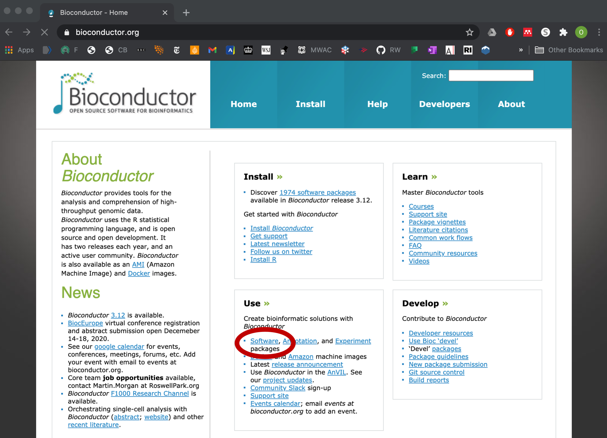
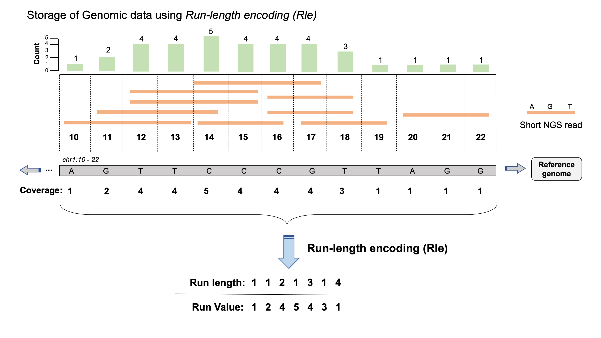
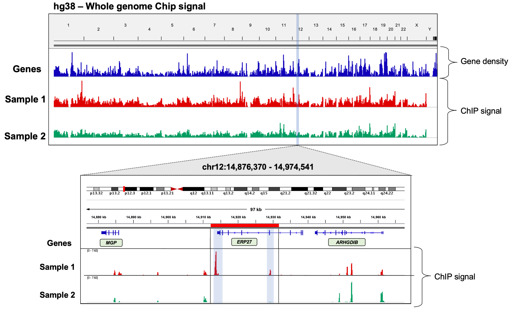

# Part 1 -  Genomic data analysis in R


By far the largest advantage to using R to perform specific stages of genomic data analysis are the large number of packages available that facilitate efficient analysis of high-throughput data. In particular, [**Bioconductor**](https://www.bioconductor.org/) is an open source project that provides a wide-range of data analysis software packages implemented in the R environment. Bioconductor packages introduce several particuarly useful object classes and methods that provide effecient storage of, access to, and maniuplation of various forms of genomics and high throughput sequencing data. 

BioConductor packages are especially noteworthy for their high level of integration and use of common object classes, making cross-compatibility of many Bioconductor packages very easy, as well as allowing previous packages to be utilized by subsequently developed packages. Applications of BioConductor packages range from simple data representation utilities to full implementations of complex statistical methodologies developed for the analysis of specfic types of genomics data. 



Explore available package on the [Bioconductor website](https://www.bioconductor.org/) and browse their Vigenettes to get an idea for the range of software available. The table below provides examples of some important BioConductor packages organized by their application/utility, as well as some more specific examples designed for analysis of specific data-types. 

**Key *Bioconductor* packages by utility.**

**Applications/utility** | **Packages**
-------|-------
Data representation | IRanges, GenomicRanges, GenomicFeatures, BioStrings, BSGenome, SummarizedExperiment
File handling & manipulation | *rtracklayer*, *BioStrings*, *ShortRead*, *Rsamtools*
RNA-seq | *DESeq2*, *edgeR*, *DEXSeq*. *EDAseq*
ChIP-seq | *ChIPseeker*, *ChIPpeakAnno*, *DiffBind*, *ChIPQC*, *TFBStools*
DNA methylation | *minfi*, *methylKit*, *ENmix*, *BiSeq*, *ELMER*
Varaint analysis | *VariantAnnotation*, *maftools*, *VariantFiltering*, *ensemblVEP*
Metagenomics | *decontam*, *philr*, *metavizr*, *BDMMAcorrect*
Single-cell analysis | *SingleCellExperiment*, *scater* *scran*, *SingleR*, *DropletUtils*
Genomic visualiuzation | *rtracklayer*, *ggbio*, *Gviz*, *clusterProfiler*, *genomation*
Genomic annotation | *GenomeInfoDB*, *TxDb*, *AnnotationHub*, *org.X.db*, *BioMart*
Gene ontology analysis | *GO.db*, *DO.db*, *rGREAT*, *fGSEA*, *clusterProfiler*, *GSVA*

#### Installing & loading Bioconductor packages 

The `Biocmanager` package, and specifically its function `BiocManager::install()` is used to install Bioconductor packages, essentially replacing `install.packages` which is used for installing *CRAN* packages. 
```{r}
install.packages('BiocManager')
BiocManager::install()
```

Bioconductor packages can then be loaded like regular R-packages: 
```
library(IRanges); library(GenomicRanges)
```

#### Handling genomic regions with Bioconductor


[GenomicRanges](https://bioconductor.org/packages/release/bioc/html/GenomicRanges.html) is an extremely useful package from the BioConductor project for working with genomic regions and coordinates in R, and lies at the core of numerous other BioConductor packages such as [BSgenome](https://bioconductor.org/packages/release/bioc/html/BSgenome.html), [rtracklayer](https://bioconductor.org/packages/release/bioc/html/rtracklayer.html) and [VariantAnnotation](https://bioconductor.org/packages/release/bioc/html/VariantAnnotation.html). 


#### Using coverage & signal track data with Bioconductor  

##### The IRanges package 

As discussed above, various types NGS assays may result in a specific set of regions of interest for further downstream analysis. For example, coding regions in RNA-seq, transcription-factor signal peaks in ChIP-seq, or accessible chromatin in ATAC-seq. Being able to store, query, and manipulate genomic regions in critical in facilitating downstream analysis of these regions. 

The *IRanges* package provides an efficient way to achieve these tasks on basic sets of integer ranges. The *GenomicsRanges* package then builds upon the IRanges functionaility to enable storage and manipulation of genomic regions on annotated sequences (chromosomes). in the below example, you can see an example set of regions on chromosome 1 of the human genome. These regions could be anything of interest, e.g. and NGS read, exon coordinates, TF peaks. 

For the purposes of IRanges however, simply consider them as a set of integer regions. In the figure, we can see how these would be specified in R if we used the `IRanges()` constructor function to generate an `IRanges` class object of the integer regions shown in orange. Each object shows that each region has a `start`, `end` and `width`. 

We could construct these two regions with the following code: 
```
# 1st region
IRanges(start = c(1), width = 4)

# 2nd region 
IRanges(start = c(11), width = 3)
```

*IRanges* objects can contain mutiple regions, which we could have contructed for these regions like this: 
```
ir <- IRanges(start = c(1,11), width = c(4, 3))
ir
```

IRanges provides numerous functions for operating on and maniuplating these regions. For example, the functions `shift()`, `narrow()`, and `resize()` for adjusting start, end and width sizes of regions stored in an `Iranges` object. Lets work through a couple of examples: 
```
# shift all of the regions by a specified offset 
shift(ir, 2)

# resize all regions to only the integer at the center of each region 
resize(ir, fix="center", width=1)
```

Lets contruct an *Iranges* class object that contains all of the integer regions shown in the figure above (normally, these regions would be defined by your data, so you wouldn't need to do this step, but it is helpful to understand). 
```
ir <- IRanges(start = c(1,2,3,3,5,6,7,7,8,11), 
              width = c(4,4,4,4,3,3,3,3,3,3))
ir
``` 

##### The GenomicRanges package 

The *GenomicRanges* package extends the functionality introduced by IRanges to allow for analysis of genomic regions within the Bioconductor framework, and severs as a foundation for accessing and manipulating genomic regions for other BioConductor packages, some of which we will discuss (e.g. *rtracklayer*, *BSGenome*, *GenomicAlignments*). 

At the core of the package is the *GRanges* class, which is analogous to the IRanges class but specifies genomic ranges denoted by a start, and end on a specific sequence (e.g. a chromosome). Lets construct a `GRanges` object for the ranges shown in the figure. 

```
gr <- GRanges(
    seqnames = rep("chr1", 10),
    ranges = IRanges(start = c(1,2,3,3,5,6,7,7,8,11), width = c(4,4,4,4,3,3,3,3,3,3)),
    names = paste0("r", "-", seq(1,10)),
    strand = c(rep("+", 2), rep("-", 3), rep("*", 3), rep("+", 2)),
    score = rnorm(10,5,2))
gr

# return the region ranges only 
granges(gr)

# return the strand info for all regions 
strand(gr)

# return teh region names  
names()

# extract the metadata columns 
mcols()
```

Now lets imagine that these regions all represent sequencing reads in an NGS experiment. A common analytical task to perform on these regions would be to ask *what is the read coverage at each genomic position*. The `coverage` function provides a convient way to address this question, by returning a vector that indicates the frequency of reads overlapping each of the genomic positions. 
```
# calculate coverage of each base over this genomic region 
coverage(gr)

# perhaps we are only interested in the regions on the + strand 
coverage(gr[strand(gr)=="+"])

# 
sum(coverage(gr))
```

Expecting a regular numerical vector? That might be OK in our small toy example here, but imagine we need to do this for regions covering an entire genome. The object size would quickly become extremely large and require significant amounts of computational memory to handle. Instead, *GenomicRanges* leverages functionaility inrtoduced by *IRanges* to compress this sort of data through a process called **Run-length encoding (RLE)**. RLE is an efficient form of data compression for instances where we have long vectors with *runs* of numbers that might be the same. Consider the example below: 



*RLE* is an especially efficient way of storing genomics data since there are often streches of repeated values in the final data representation, and often long streches of sequences are not considered in an experiment (e.g. non-coding regions in RNA-seq) so we shouldn't waste space storing information on those positions. RLE is emplyed in the BIGWIG file format to allow efficient storage and access to signal track data against a reference genome. Consider the below example in the context of a ChIP-seq experiment. 





GRanges objects can be indexed similar to regular objects in R, their intervals can be manipulating using the same functions introduced above for IRanges objects, and queried/manipulated using additional method functions available in the GenomicRanges package. Lets explore some of these. 
```
# index GRange object for specific elements 
gr[1]
gr[[1]]
gr[1][["r-1"]]

# view the top X regions of interest 
head(gr, n=5)

# view the top X regions with scores greater than a value of interest 
head(gr[score(gr)>4], n=5)

# shift all regions 5bp 
shift(gr, 5)

# resize all regions by requiring them to be 5bp wide 
resize(gr, 5)

# reduce the regions to one simplified set of non-overlapping regions 
reduce(gr)
```

##### Storing and operating on sets of GRanges 


EXMPLE SECTION - maybe try senter around a finding from encode or roadmap projects in paper
(or find another paper where you can find an example) 
DOWNLOAD ROADMAP EPIGENOMICS DATA OR ENCODE DATA AND USE AS EXAMPLE 
COMPARE CHROMATIN MARKS FROM CHIP SEQ FROM 2 SAMPLES, 
MAKE INTO GRANGES LIST 
ANNOTATE TO TRANSCRIPT FEATURES (USING A GFF FILE FOR READING IN)
GET OVERLAPPING PEAKS
GET SOME UNIUE PEAKS
VISUALIZE THEM 
IMPORT THE BIGWIGS AND PLOT THEM 


Separate GRanges objects can also be combined into lists using the class `GRangesList` . 
There are many reasons you might wish to group GRanges objects into a list, for example: 
* 
```


grl <- GRangesList("txA" = gr1, "txB" = gr2)

```


GRanges objects can also be queried against each other. For example, you might want to find all the overlapping regions between 2 different sets of genomic ranges. 

Image from Bioconductor turiotrial (linked [here]())


These are analogous to functionalities from command line utilities like BEDTools.  

BEDTools image 


The [BioConductor website](https://bioconductor.org/packages/release/bioc/html/GenomicRanges.html) for *GenomicRanges* has some excellent vignettes and how tos for specific tasks, e.g. *"how to find peaks in read coverage"*. I encourage you to go and explore these. 


genomation: 
reading in genomics data with r trackleyer and other file formats (Rsamtools for FASTQ..?/FASTA)
annotation of genomic intervals (maybe just use a small fasta file of a chr for this exercise) 


reading in as flat files 
reading in genomics data files with special functions 
cover bed, gff, bigwig 


## Data containers, maybe Part 3..?
SummarizedExperiment style packages
adding gene annotation data to these 
counting up over genomic regions 
singlecellexperiment package 


# visualization packages in R for genomics data 
GViz


This is not mean't to be a comprehensive introduction to the complete functionality of *GenomicRanges*, or replace the excellent tutorials or Vigenttes available on the Bioconductor website. 


