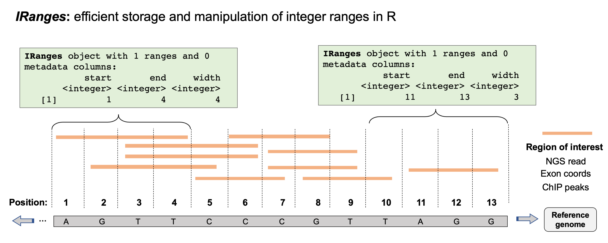

# Part 2 working-with-genomics-data-in-R.md


reading in as flat files 
reading in genomics data files with special functions 
cover bed, gff, bigwig 


### The GenomicRanges R-package

[GenomicRanges](https://bioconductor.org/packages/release/bioc/html/GenomicRanges.html) is an extremely useful package from the BioConductor project for working with genomic regions and coordinates in R, and lies at the core of numerous other BioConductor packages such as [BSgenome](https://bioconductor.org/packages/release/bioc/html/BSgenome.html), [rtracklayer](https://bioconductor.org/packages/release/bioc/html/rtracklayer.html) and [VariantAnnotation](https://bioconductor.org/packages/release/bioc/html/VariantAnnotation.html). 

The goal of this lesson is to introduce you to the major object classes used by *GenomicRanges*, how they work, and together explore some examples of how you could use the package in your own work. This is not mean't to be a comprehensive introduction to the complete functionality of *GenomicRanges*, or replace the excellent tutorials or Vigenttes available on the [BioConductor website](https://bioconductor.org/packages/release/bioc/html/GenomicRanges.html)

Lets load the GenomicRanges package: 
```{r}
library(GenomicRanges)
```





continuous run data in R, and rle class for bigwigs and signal tracks 


genomation: 
reading in genomics data 
annotation of genomic intervals (maybe just use a small fasta file of a chr for this exercise) 


## Data containers, maybe Part 3..?
SummarizedExperiment style packages
adding gene annotation data to these 
counting up over genomic regions 


# visualization packages in R for genomics data 
GViz


