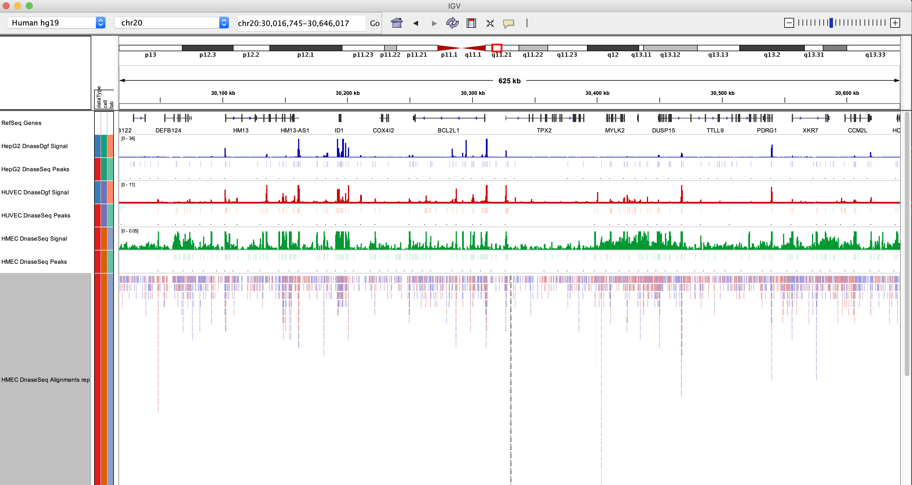
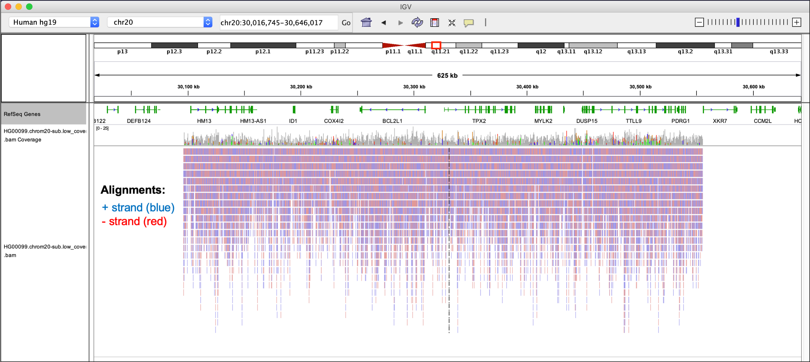
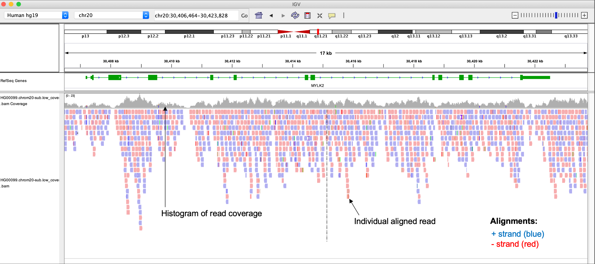
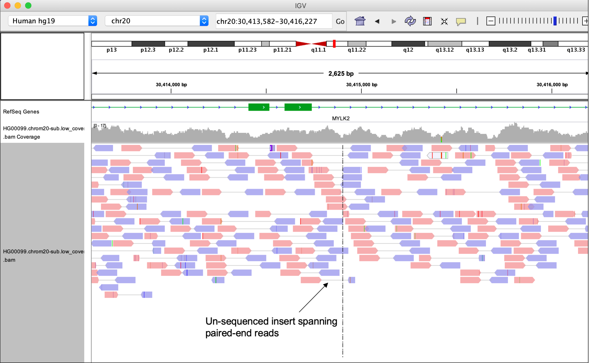
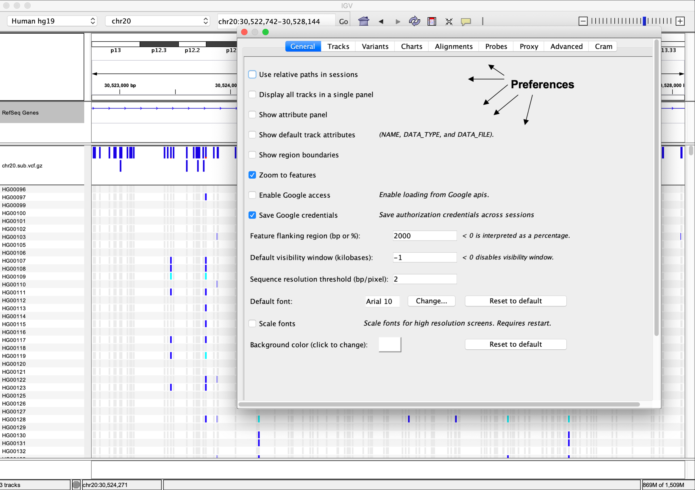
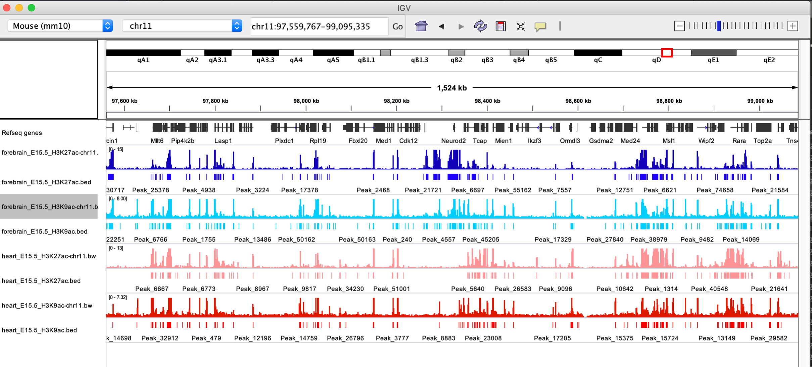
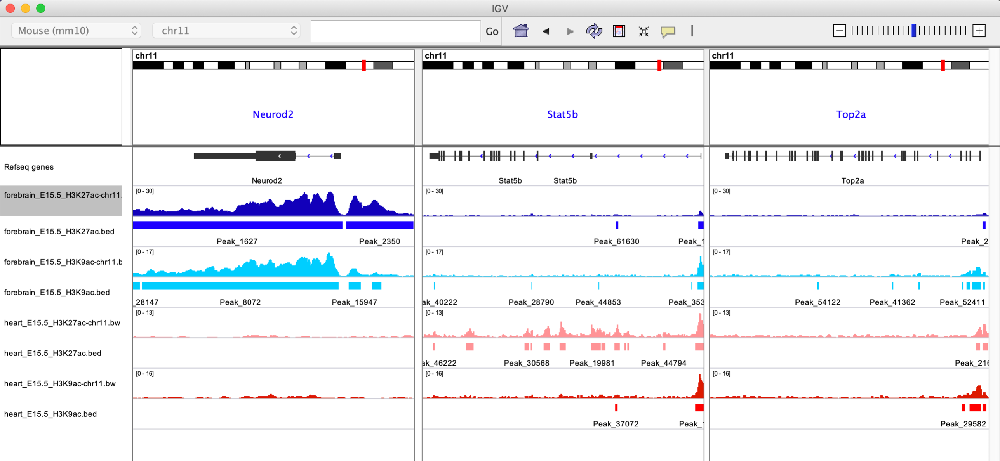

# Introduction to the Integrative Genomics Viewer (IGV) 

## What is IGV?

The **Integrative Genomics Viewer (IGV)** is a very powerful piece of genomics software produced and distributed by researchers from the Broad Institute at MIT. IGV provides a fast and easy way to explore and visualize genomics data stored in various formats. 

other genome browswers and UCSC

File types suppoprted by IGV include:  
* .BAM - alignments  
* .GTF/GFF - genomic features  
* .VCF - variant call format  
* .BED - genmoic regions   
* .BIGWIG - signal tracks  

The range of file formats supported by IGV means it is able to facilitate exploration and visualization of virtually all types of genomics data generated from diverse experimental procedures, for example: 
* Gene expression data (RNA-seq)  
* SNP, mutation and copy number data (WES, WGS)  
* Transcription factor binding sites (ChIP-seq)  
* Hostone modifications (ChIP-seq)  
* Chromatin accessibility (ATAC-seq)  
* Methylation (Bisulfite sequencing)  

The IGV server also hosts a number of reference genomes and annotations, meaning you do not need to load your own genome from a file for many model organisms. You can view the list of hosted genomes on their website [here](http://software.broadinstitute.org/software/igv/Genomes). IGV also provide access to data from large consortia-scale projects such as [*ENCODE*](https://www.encodeproject.org/), [*1000 Genomes*](https://www.internationalgenome.org/home), and [*The Cancer Genome Atlas (TCGA)*](https://www.cancer.gov/about-nci/organization/ccg/research/structural-genomics/tcga). 

If you use IGV in your publications, you should at cite at least the original publication [(found here)](https://www.nature.com/articles/nbt.1754). 

## How do we use IGV?

IGV can be installed and run locally on MacOS, Linux and Windows as a Java desktop application (which is how we will use it today). You should have all downloaded and installed the Desktop version of IGV for the operating system you are working on. 

An example of how a typical IGV session might look is included below. In this example, we have:
- Called peaks from multiple DNase-seq experiments (.BED) 
- DNase-seq signal tracks representing chromatin accessibility (.BIGWIG) 
- Representative alignments from one experiment (.BAM) 

There is now also an [IGV web-app](https://igv.org/app/) that does not use Java and only needs an internet browser. 

## Learning objectives: 

In todays lesson, we will cover:  
* An overview of the IGV user interface and basic navigation
* Loading genomes and data into an IGV session
* Discuss and explore how IGV represents data stored across distinct file types 
* Discuss exploratory analyses and visualizations that IGV is useful for
* Reading in custom genomes
* Saving and restoring an IGV session 

**Note:** This is by no means a comprehensive guide to IGV. Far more functionality exists than we have discussed here, which can be explored in more detail on their website and using the [IGV User Guide](https://software.broadinstitute.org/software/igv/UserGuide). 

### The basic IGV interface and basic navigation

exploring the gene track (+/- strand)

### Loading genomes and data into an IGV session

#### Working BAM files (alignments) in IGV

viewing alignments in igv (.bai indexes)

Example data from 1000G 
Hovering over reads 
gray colors in reads vs colored bases for mapping 
empty reads for bad mapping quality 
paired end reads vs single end reads 
colors for bases different to reference 
insertions and deletions 

you can start to see how igv is useful for helping us idnetify features of our data, for example potential variants. infact IGV allows us to bring in multiple file types simulatneously so that they can be evaluated together. 

For example, it can be very useful to visualize variant calls (e.g. in a whole-genome sequencing experiment) alongside the alignment file, in order to review the evidence for specific variants. 

To demonstrate this, lets load a VCF file for the same region on chr20, containing all the called variants across subjects i the 1000 Genomes project (phase 3). 

what are we not covering - advanced variant evaluation and review in igv 

things you can change in preferences 

Note: alignment from different types of data are going to look very different! 

load in a chip seq bam and an rnaseq bam and discuss why they are different looking 
maybe also subset rnaseq chr 20 bam 

#### Working with genomic coordinate data (.BED) and signal tracks (.BIGWIG)

A common task that you might want to do with IGV is to explore a set of regions identified as of interest from a particular experiment. Commonly, these include peak regions called in a ChIP-seq, DNase-seq, or ATAC-seq experiment (for example), which have been identified by a peak calling algorithm that identifies regions of read *'pileups'* that have read density above a background level. 

Lets read in some example ChIP-seq data to demonstrate how you might go about exploring such data. We will use data from a recently published study of the dynamic regulaorty landscape in the developing mouse ([Gorkin *et al*, 2020](https://www.nature.com/articles/s41586-020-2093-3?proof=t)). 

In this study, the autors generate an atlas of the dynamic chromatin landscape at various time points during mouse embryonic development, conducting over 1100 ChIP-seq experiments and 132 ATAC-seq experiments spanning 72 stages of development across various tissues.

**Figure 1A-B from Gorkin *et al*, 2020, Nature**. 

In particular, we will use ChIP-seq data generated in immunoprecipation experiments for several histone modifications, whose presence and absence can be used to infer the functional state of chromatin at specific loci (e.g. active transcription, enhancers, heterochromatin). These data have been downloaded and made available in this github repo, in: `Bioinformatics_workshop/Day-2/data/gorkin-et-al/`.

Since this experiment uses alignment generated against mouse refernce mm10, we need to switch the genome slected in IGV before we load in any data. 

then load in 1 sample, bed, bigwig and bam, to show how the signal track relates to the bam 

What we really want to do however is compare between sample groups (in this case, forebrain vs heart tissue), so we need to load in the tracks for the other samples. 

remove the bam and bigwig for now, load the other bed and bigwigs, add color to them by right clicking 

Scroll around and have a look at some regions on chr20. 

OWEN: 
- subset BIGWIG file for chr20 region of interest 

Now zoom in on gene X. You can see more H3K27ac and H3K9ac in forebrain samples, that might suggest this gene is more transcriptionally active in forebrain than heart tissue. 

Alternatively, 

This is useful, but what if we want to get an idea of how much the peak signal changes between the groups. For this, we can add the signal tracks from each experiment. Color them the same way as their respective bed files 

Now we can see.. 

This helps us build expectations for what we might see in our downstream analysis, for example a differential binding analysis, or allows us to confirm findings once we have performed those analyses. 

comparing tracks in igv, need for normalization 

split view and compare 2 regions 
Neurod2 Stat5b Top2a

#### Saving and restoring sessions in IGV 

#### Loading custom references and annotations 

**Remember:** This lesson is only designed to serve as an introduction to IGV. 

