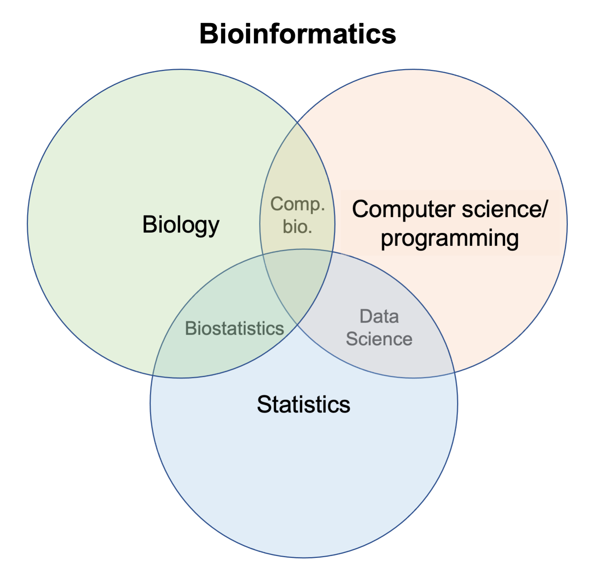

# Introduction to Statistical Learning & Inference in bioinformatics 

As we discussed on day 1, bioinformatics draws on knowledge from multiple disciplines. To effectively solve most bioinformatic problems, knowledge from each of these disciplines must be applied to address the overall problem. Developing a working knowledge of statistics is key for anyone hoping to solve bioinformatic problems. 

Adaopted from Md Arman Hossen on [Medium](https://medium.com/datadriveninvestor/i-have-designed-my-own-bioinformatics-degree-260b24767d87). 

Statistics involves the analysis of numerical data that we wish to use for making inferences on a larger population. Generally, **statistical learning** refers to the models and procedures with which we analyze these numerical datasets. 

These models and procedures can be used to either make **predictions** (e.g. healthy vs. diseased tissue based on gene expression profiles) or for **statistical inference**, where tools from statistical learning are applied to help us understand the relationship between a set of variables (e.g. which genes are associated with diseased tissue). 

While a comprehensive introduction to *statistical learning and inference* is well beyond the scope of this workshop (and generally takes years of specific training and experience), we will introduce some fundamental concepts required for approriate statsitcal analysis of genomics data sets that are relevant to wet- or dry-lab scientists alike. 

**What we <u>will<\u> cover:**  
- What is statistical learning? 
- Basics of supervised & unsupervised data analysis methods
- Fundamentals of statistical inference & hypothesis testing 
- *P*-values & multiple testing correction 

**What we <u>will not<\u> cover:**  
- Math & probability theory underlying statistical learning procedures
- Model selection procedures & how to assess model fit 
- A comprehensive introduction to the methods used for statistical learning and inference in bioinformatics

> **Important note:** Builing a more complete understanding of the statistical procedures commonly used in bioinformatics, such that you are able to confidently implement, interpret, and troubleshoot these procedures, requires a strong working knowledge of relevant math and probability theory. Such training is best sought out through formal instruction, and is usually not included in applied bioinformatics courses. \\ 
While developing an understanding of the fundamental concepts in statistical learning and inference covered here will allow you to begin leveraging more complex statistical analyses in your own research, and act as a solid fondation upon which to further your training in this domain, it is also important to recognize when more specialist expertise is needed to address your analytical questions. 

## Statistical learning 

- want to learn relationship between some dep var Y and independent variables X 
    - provide diverse examples of what this could be.. patients gorups, tx group, evo model fitting tree best 
- use hypothesis testing prodcedures to assess relationship between X and Y (talk about estimation..?)

### Supervised vs. unsupervised methods

- (statistical learning part - bridge into this by saying methods modeling a response are generally refered to as supervised methods, but we often want to know relations etc without a response var)unsupervised methods for when we have no dep. / response variable but want to explore 
relation between samples. why ios this useful compared to hypothesis testing and supervised methods? 

### Linear modeling 

$$  Y= \beta_0+\beta_1X + \epsilon $$ 

Linear modeling is a common approach for statistical inference in bioinformatics, especially for genomics. Linear models provide flexible and generally interpretable ways of performing these statistical inferences. 

Many non-linear approaches to perform statistical inference are being employed to bioinfromatics data sets. As these models gain complexity and loose flexibility, they tend to become less interpretable, making them useful tools for making predictions. 

Critical for RNA-seq, ChIP-seq, microarray data, GWAS, 

Batch correction example 

- linear modeling (could move up or down? could be in estimation step..?)
    - justify by saying linear modeling is a very straightfoward way for modeling a continuious response variable (or discrete in generalized models) that has been applied to many data types and scenarios in hypothesis testing of bioinformatic and genomics data, therefore we will discuss the basics of linear modeling since an understanding of this is cruicial to performing or understanding tehse analyses 
    - use basic example dataset of expression vs treatment, but mention in relaity we used generalized linear models for many data types to more appropriate model the distribution of those data types (e..g RNA seq neg binom.) based on some other variables, and has therefore been adopted heavily in genomics 

### Unsupervised data analysis 

## Statistical inference 

statsitical inference refers to: 
estimation
hypothesis testing 

mention MLE 

### What is *hypothesis testing*?

### What is a *P*-value?

### The multiple testing problem

### Methods for multiple testing correction

